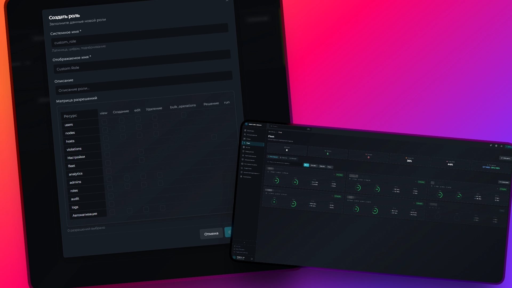
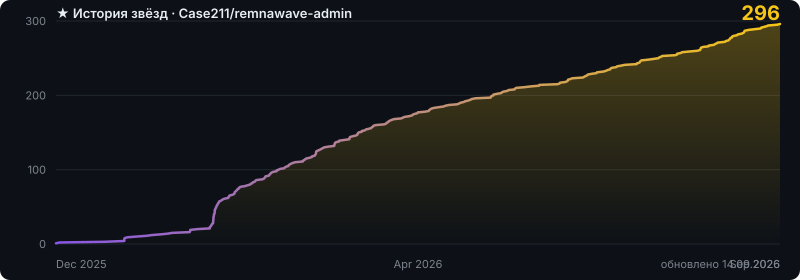

<div align="center">



# Remnawave Admin

**A control panel and Telegram bot on top of your Remnawave panel**

Users, nodes, anti-abuse, mail and monitoring in one place

[](https://github.com/Case211/remnawave-admin/stargazers) [](https://github.com/Case211/remnawave-admin/releases/latest) [](https://github.com/Case211/remnawave-admin/commits/main) [](LICENSE)

[](https://www.docker.com/) [](https://www.python.org/) [](https://react.dev/) [](https://case211.github.io/remnawave-admin/en/guide/monitoring)

### [📖 Documentation](https://case211.github.io/remnawave-admin/en/) · [🚀 Install](https://case211.github.io/remnawave-admin/en/guide/installation) · [💬 Chat](https://t.me/remnawave_admin)

English · [Русский](README.md)

</div>

---

The Remnawave panel owns users and configuration. Remnawave Admin takes care of everything else: it collects connections from your nodes, hunts for subscription sharing, sends notifications, keeps the history and shows you what is going on.

It works on top of your panel over the API and keeps its data in its own database. One command to install, everything optional can be switched off.

## Features

🛡 **Anti-abuse.** Seven analyzers look for subscription sharing: simultaneous connections, impossible travel, ASN, behaviour, devices, HWID, User-Agent. It counts sources rather than addresses, so mobile CGNAT no longer looks like a crowd of four. [More](https://case211.github.io/remnawave-admin/en/guide/anti-abuse)

🧲 **Torrent detection.** The Xray routing tag plus traffic inspection through nDPI, so encrypted BitTorrent, DHT and uTP are visible too. One toggle; the daemon ships inside the agent. [More](https://case211.github.io/remnawave-admin/en/guide/torrents)

🛰 **Agent on your nodes.** Reads Xray logs, collects host metrics, provides a remote terminal and a script catalogue. Installed with a single line generated by the panel. [More](https://case211.github.io/remnawave-admin/en/guide/node-agent)

📧 **Mail server.** Direct MX delivery, DKIM, inbound mail, SPF/DKIM/DMARC checks and DMARC report parsing — no external SMTP provider. [More](https://case211.github.io/remnawave-admin/en/guide/mail)

📈 **Monitoring.** Prometheus metrics out of the box, 30+ custom gauges and five ready-made Grafana dashboards. [More](https://case211.github.io/remnawave-admin/en/guide/monitoring)

🤖 **Telegram bot.** Manage things from a chat, notifications with action buttons, routing across forum topics. [More](https://case211.github.io/remnawave-admin/en/guide/bot)

🔌 **Plugins and API.** A plugin store inside the panel, an API v3 with keys and scopes, outgoing webhooks with signatures. [More](https://case211.github.io/remnawave-admin/en/guide/plugins)

📱 **Android app.** Home-screen widget, push notifications, several panel profiles.

Also: a connection geo map, analytics with minute-level granularity, an automation builder, scheduled backups, an audit log, RBAC with roles and permissions, TOTP and biometric login, seven themes, and full Russian and English translations.

## Installation

```bash
git clone https://github.com/Case211/remnawave-admin.git
cd remnawave-admin
cp .env.example .env
nano .env                          # bot token, panel API, your Telegram ID

docker network create remnawave-network
docker compose up -d
```

Next: [reverse proxy and domain](https://case211.github.io/remnawave-admin/en/guide/web-panel), then [the agent on your nodes](https://case211.github.io/remnawave-admin/en/guide/node-agent).

Full guide: **[case211.github.io/remnawave-admin](https://case211.github.io/remnawave-admin/en/guide/installation)**

## Requirements

| | Up to 1,000 users | 1,000–5,000 | 5,000–20,000 | 20,000+ |
|---|---|---|---|---|
| CPU | 2 vCPU | 4 vCPU | 8 vCPU | 8–16 vCPU |
| RAM | 4 GB | 8 GB | 16+ GB | 32+ GB |
| Disk | 40 GB SSD | 80 GB SSD | 240 GB NVMe | 240+ GB NVMe |

Plus Docker, a Remnawave panel with API access and a Telegram bot. Images are built for `amd64` and `arm64`.

## Documentation

| Section | About |
|---------|-------|
| [Installation](https://case211.github.io/remnawave-admin/en/guide/installation) | from nothing to a working panel |
| [Environment variables](https://case211.github.io/remnawave-admin/en/reference/env) | the full reference |
| [Web panel and proxy](https://case211.github.io/remnawave-admin/en/guide/web-panel) | Caddy, nginx, WebSocket, split mode |
| [Anti-abuse](https://case211.github.io/remnawave-admin/en/guide/anti-abuse) | analyzers, thresholds, incident review |
| [Public API](https://case211.github.io/remnawave-admin/en/reference/api) | keys, scopes, endpoints |
| [Webhooks](https://case211.github.io/remnawave-admin/en/reference/webhooks) | events, signatures, retries |
| [Troubleshooting](https://case211.github.io/remnawave-admin/en/guide/troubleshooting) | what to do when it does not work |

## Contributing

Bugs and ideas go to [issues](https://github.com/Case211/remnawave-admin/issues). Pull requests are welcome; the first one asks you to sign the [CLA](CLA.md). Details in the [guide](https://case211.github.io/remnawave-admin/en/guide/contributing).

## Licence

GNU AGPL v3.0 with a plugin exception (§7) — see [LICENSE](LICENSE). Versions up to and including 2.15.x remain under MIT. A commercial licence is available on request.

## Support the project

TON `UQDDe-jyFTbQsPHqyojdFeO1_m7uPF-q1w0g_MfbSOd3l1sC`
USDT TRC20 `TGyHJj2PsYSUwkBbWdc7BFfsAxsE6SGGJP`
BTC `1J6Zz7XcrpFkchwFmuU5WTFYTxziBdSwRz`

<div align="center">

<a href="https://github.com/Case211/remnawave-admin/stargazers">
  
</a>

Built for the Remnawave community

</div>
